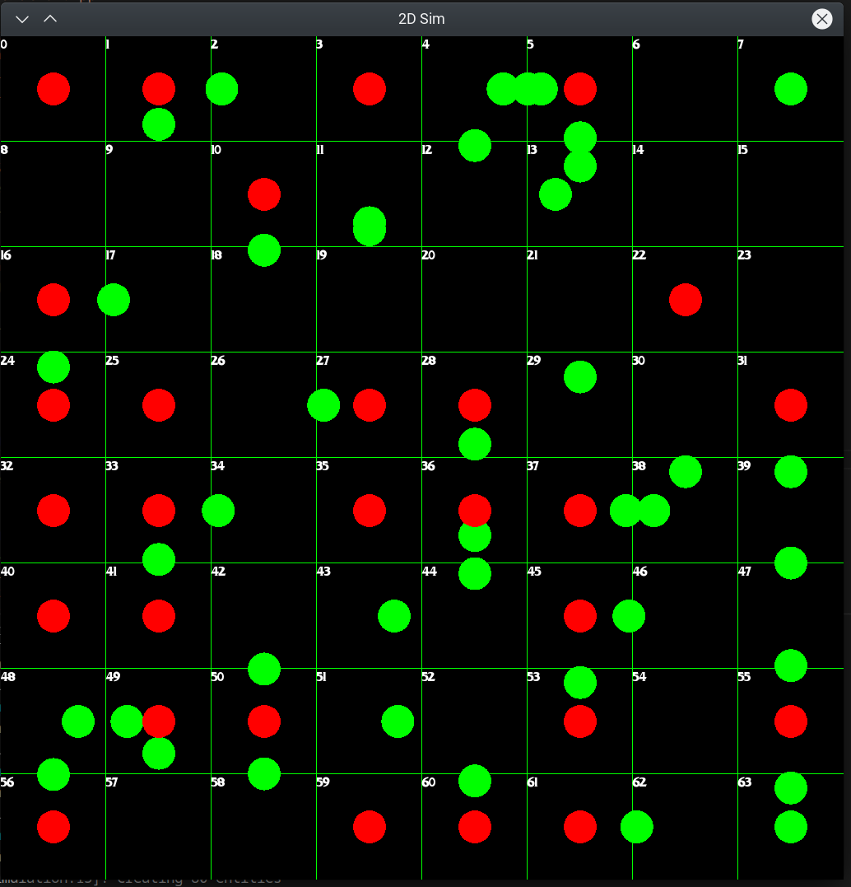

# 2D Simulation
=======================

### Overview
--------

This project is a 2D simulation built using C++ and SFML. It is designed to demonstrate a basic 2D simulation with resource management.

### Screenshots
--------

### Building and Running
--------------------

To build and run this project, follow these steps:

1. Clone the repository: `git clone https://github.com/gfeyer/2d_sim.git`
2. Navigate to the project directory: `cd 2d_sim`
3. Create a build directory: `mkdir build`
4. Navigate to the build directory: `cd build`
5. Run CMake: `cmake ..`
6. Build the project: `cmake --build .`
7. Run the simulation: `./main`

Note: This project requires SFML and CMake to be installed on your system.

### Acknowledgments

This project uses the SFML library for graphics and input handling.
